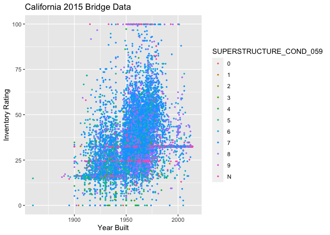

433 HW 1
================
Juliana Brandt
2/4/2021

Warm up: make a file with bridge ID, year, fips codes, condition
ratings, and a few other variables that interest you. Make your code
reproducible. Make a plot. Things to do first: (i) look at a few lines
of the raw data, (ii) look at the data description. Work independently,
in small groups. (Share ideas and functions, but not
code)

``` r
#Loading the dataset from url and viewing the first 5 rows of the dataset  
CA15 = read_csv("https://www.fhwa.dot.gov/bridge/nbi/2015/delimited/CA15.txt")
```

    ## 
    ## ── Column specification ────────────────────────────────────────────────────────
    ## cols(
    ##   .default = col_double(),
    ##   STATE_CODE_001 = col_character(),
    ##   STRUCTURE_NUMBER_008 = col_character(),
    ##   ROUTE_NUMBER_005D = col_character(),
    ##   HIGHWAY_DISTRICT_002 = col_character(),
    ##   COUNTY_CODE_003 = col_character(),
    ##   FEATURES_DESC_006A = col_character(),
    ##   CRITICAL_FACILITY_006B = col_logical(),
    ##   FACILITY_CARRIED_007 = col_character(),
    ##   LOCATION_009 = col_character(),
    ##   LRS_INV_ROUTE_013A = col_character(),
    ##   LAT_016 = col_character(),
    ##   LONG_017 = col_character(),
    ##   MAINTENANCE_021 = col_character(),
    ##   OWNER_022 = col_character(),
    ##   FUNCTIONAL_CLASS_026 = col_character(),
    ##   DESIGN_LOAD_031 = col_character(),
    ##   RAILINGS_036A = col_character(),
    ##   TRANSITIONS_036B = col_character(),
    ##   APPR_RAIL_036C = col_character(),
    ##   APPR_RAIL_END_036D = col_character()
    ##   # ... with 44 more columns
    ## )
    ## ℹ Use `spec()` for the full column specifications.

``` r
#creating a smaller dataset with bridge ID, year, fips codes, condition ratings, and a few other variables that interested me
 
small.CA15 = CA15 %>% select(STRUCTURE_NUMBER_008, YEAR_BUILT_027,  COUNTY_CODE_003, 
         SUPERSTRUCTURE_COND_059, SUBSTRUCTURE_COND_060, CHANNEL_COND_061, 
         CULVERT_COND_062, OPR_RATING_METH_063, OPERATING_RATING_064, INV_RATING_METH_065, 
         INVENTORY_RATING_066, STRUCTURAL_EVAL_067, 
         ROADWAY_WIDTH_MT_051,
         TRAFFIC_LANES_ON_028A, STRUCTURE_TYPE_043B)
head(small.CA15)
```

    ## # A tibble: 6 x 15
    ##   STRUCTURE_NUMBE… YEAR_BUILT_027 COUNTY_CODE_003 SUPERSTRUCTURE_…
    ##   <chr>                     <dbl> <chr>           <chr>           
    ## 1 06 0021                    1941 089             6               
    ## 2 1CA0070                    1949 111             5               
    ## 3 1CA0095                    1985 073             7               
    ## 4 1CA0141                    1948 111             7               
    ## 5 1CA0142                    1948 111             7               
    ## 6 1CA0417                    1990 073             N               
    ## # … with 11 more variables: SUBSTRUCTURE_COND_060 <chr>,
    ## #   CHANNEL_COND_061 <chr>, CULVERT_COND_062 <chr>, OPR_RATING_METH_063 <chr>,
    ## #   OPERATING_RATING_064 <dbl>, INV_RATING_METH_065 <chr>,
    ## #   INVENTORY_RATING_066 <dbl>, STRUCTURAL_EVAL_067 <chr>,
    ## #   ROADWAY_WIDTH_MT_051 <dbl>, TRAFFIC_LANES_ON_028A <dbl>,
    ## #   STRUCTURE_TYPE_043B <chr>

``` r
#creating the plot with chosen variables
library(ggplot2)
small.CA15$COUNTY_CODE_003 = as.factor(small.CA15$COUNTY_CODE_003)
 
ggplot(small.CA15, aes(YEAR_BUILT_027, INVENTORY_RATING_066, color = SUPERSTRUCTURE_COND_059)) + geom_point(size = 0.5) + theme_grey() + labs(x = "Year Built", y = "Inventory Rating", title = "California 2015 Bridge Data")
```

    ## Warning: Removed 418 rows containing missing values (geom_point).

<!-- -->
